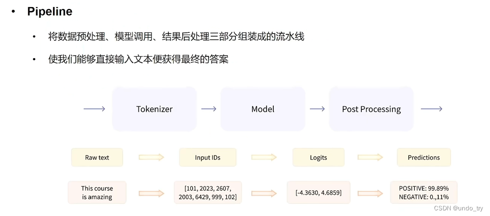

# 主要代码
    ```python
        from transformers import *
        import torch
        # 初始化 Tokenizer
        tokenizer = AutoTokenizer.from_pretrained("uer/roberta-base-finetuned-dianping-chinese")
        # 初始化model
        model = AutoModelForSequenceClassification.from_pretrained("uer/roberta-base-finetuned-dianping-chinese")
        # 数据预处理
        inputs = tokenizer("我觉得不太行！", return_tensors="pt")
        #  模型预测
        res = model(**inputs)
        logits = res.logits
        logits = torch.softmax(logits, dim=-1)
        # argmax 归一化处理 
        pred = torch.argmax(logits).item()
        model.config.id2label
        # id2label 当前模型中的一个属性看文档
        result = model.config.id2label.get(pred)
        result

    ```


